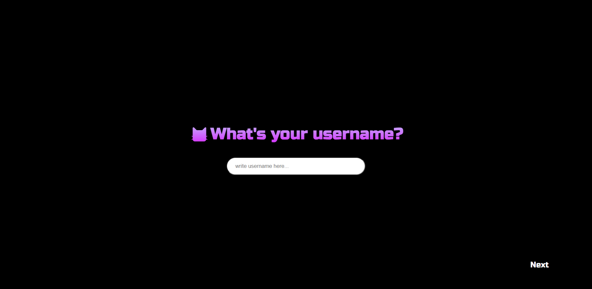
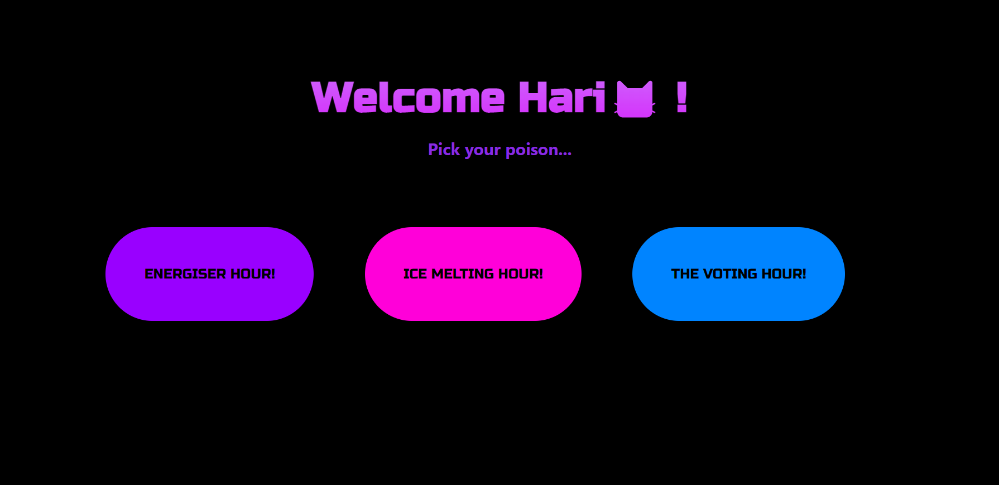
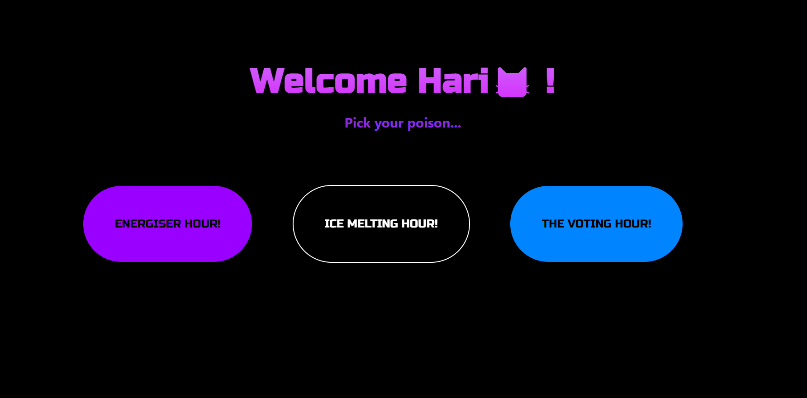
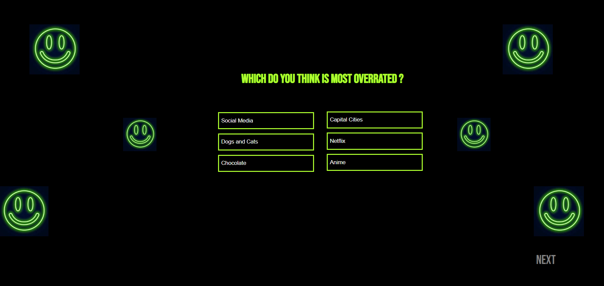
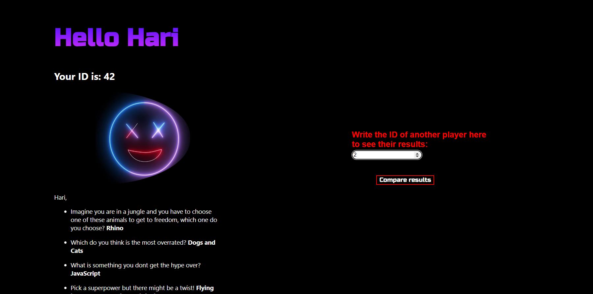
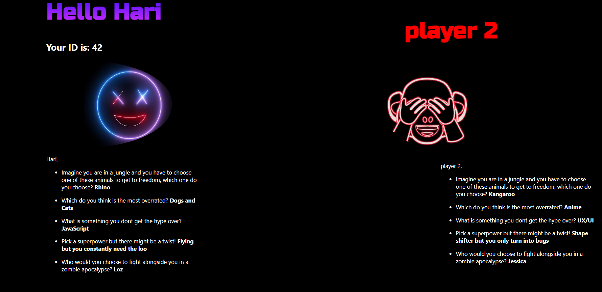

# THE ICE MELTER APP

<i>The Ice Melter App is an app is a new take on the
conventional ice breaker appraoch, it's designed to help
bootcampers connect better and more comfortably with 
their new pairs. It takes the bootcamper through a
series of fun questions which later can be discussed 
and perhaps debated with their pair at the end. All you 
need is your pairs ID then debate away.</i><br/>

<br/><b><h1 style="font-style: bold; font-size: 15px;">The Problem?</h1></b>
<i>Meeting new partners for the week can be nerve racking,
sometimes you don't know what to say, sometimes their are
awkward moments and sometimes you are tired of reintroducing
yourself to someone new each week. Is there a better way of
breaking the ice with a new partner?</i><br/>

<br/><b><h1 style="font-style: bold; font-size: 15px;">The Solution?</h1></b>
<i>Introduce a new way of geeting to know you new weekly pair,
create an app that facilitates bonding through a fun 
activity and discussing your answers, learn more about 
your partner.</i>


<br/>

## Screenshots of the app,

<br/>
This is the Home page, you start by typing in a username of your choice, which will be your ID throughout the app<br/>

<br/>
<br/>
You will then arrive at a selection Menu, select the 'Ice Melting Hour', the other options are in the works.<br/>

<br/><br/>
You will then be taken through a series of questions, select your choice then click on the Next button located<br/>
on the bottom right.<br/>

<br/><br/>
Then once you've arrived at the last question, click submit which will take you to a results page where your<br/>
answers to each of the questions will be displayed.><br/>

<br/><br/>
You will then be able to input your partners ID number and compare their results againsts yours. And if<br/>
you are feeling particularly noisy you can input a different number from previous players and check their choices.<br/>

<br/>

## The Component Tree,


<br/>

## How to run Locally

You will need to open two terminals to (navigate) between
both the back-end and the front-end of the project and You
will need to use two different PORT numbers one for the 
back-end, another for the front-end.  

clone the project

```bash
  git clone front-end repo https://github.com/SchoolOfCode/bc13_w9_project-frontend-let-s-git-on.git
  git clone back-end repo https://github.com/SchoolOfCode/bc13_w9_project-backend-let-s-git-on.git
```

Go to the project directory

```bash
  cd my-app
```

Install dependencies on both repos

setting it up

```bash
  npm install
```

Start the server

```bash
  npm run start (on both repos)
```


<br/>

## Languages,

<i>JavaScript, HTML5, CSS3, SQL</i>

<br/>

## Libraries and Frameworks,

<i>JReact.js, Node.js, Nodemon, Dotenv, Express.js, PG Postgres, Jest, Morgan, Cypress</i>


<br/>

## Testing,

Using Jest Unit Testing was achieved, to run any further test with Jest run 
```
run Jest npm test
```

Using Cypress Library End-to-End testing was done on the app, to run any further test with cypress run...
```
 npx cypress run
```
Then,
```
cypress: open
```
<br/>

## Authors,

@aliafarhana88,
@BenPuusta,
@B2ella,
@Suzi-Clark</i>

